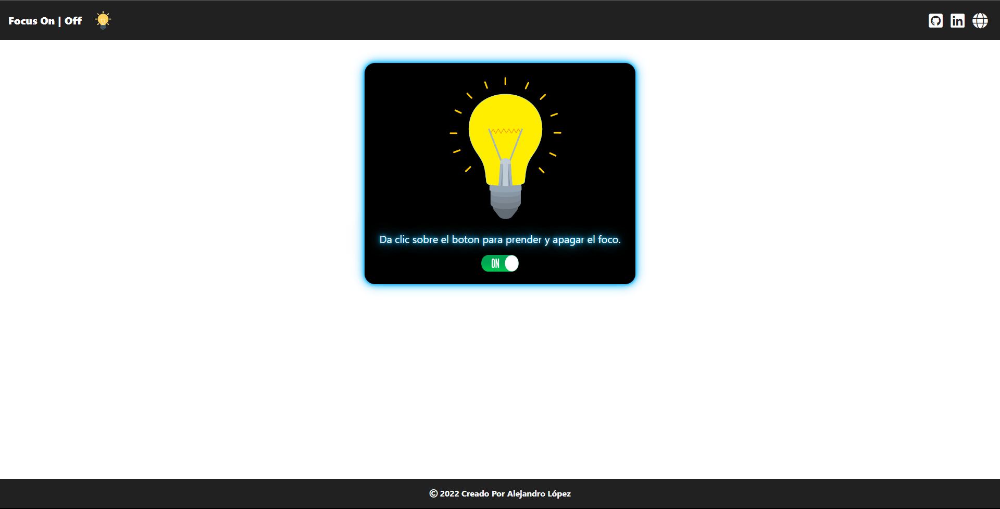

# <h1 align="center" style="color: #80cbc4;"> Focus ON | OFF 👨🏻‍💻 </h1> 
  

This is a simple web application in which JavaScript is applied to be able to make the simulator work by turning a light bulb on and off.
         
  

## 
 Requirements 

- [HTML5](https://developer.mozilla.org/es/docs/Web/HTML) 
- [CSS3](https://developer.mozilla.org/es/docs/Web/CSS)
- [JavaScript](https://developer.mozilla.org/es/docs/Web/JavaScript)

  

## 
 Screenshot Project 💻 

🔶 [Project Website](https://alejandro-190107.github.io/Light-Bulb/)

